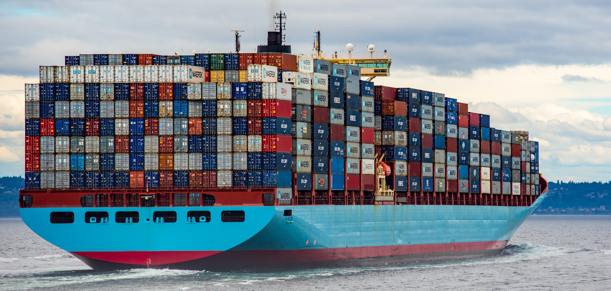
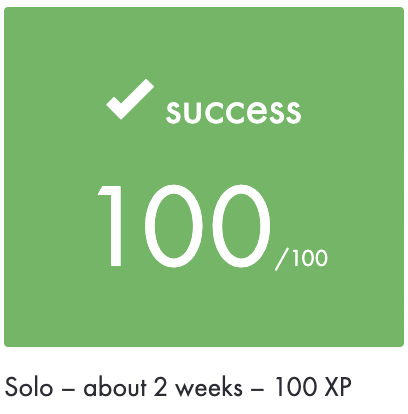

# Docker-1 - Now, you’re thinking with containers...

> *Virtual machine virtualizes hardware, Docker virtualizes Operating system.*

## Description

In Docker project first you learn to use basic commands to use actual Docker software. 
After that we start to handle different kind of containers and combining those together. 
Last part of the project is make your own **Dockerfiles** and in example launch your own local [Gitlab](https://about.gitlab.com/) server.

# [PDF](./docker-1.pdf)

## Commands

`docker start` - run already renamed/created container

`docker ps [-a] [-q]`  - view running docker

`docker pull` - pull dockers from dockerhub

`docker exec -it <name of the container> bash` - access the container shell

`docker run -d -t —-name “rename your docker” <name of image>` - run docker image

`docker pull “docker hub link”:version` - pull different version of the docker image

`docker stop <name of the docker>` - stop container

`docker -d` - run container in a background

`docker ps -a` - see traces of all containers

`docker inspect <name_of_volume>` - see location of volume

# Resources

## Best practices

[Best practices for writing Dockerfiles](https://docs.docker.com/develop/develop-images/dockerfile_best-practices/)

## Docker documentation

[Docker Documentation](https://docs.docker.com/)

## You need to learn Docker right now

[You need to learn Docker RIGHT NOW!!](https://youtu.be/eGz9DS-aIeY)

